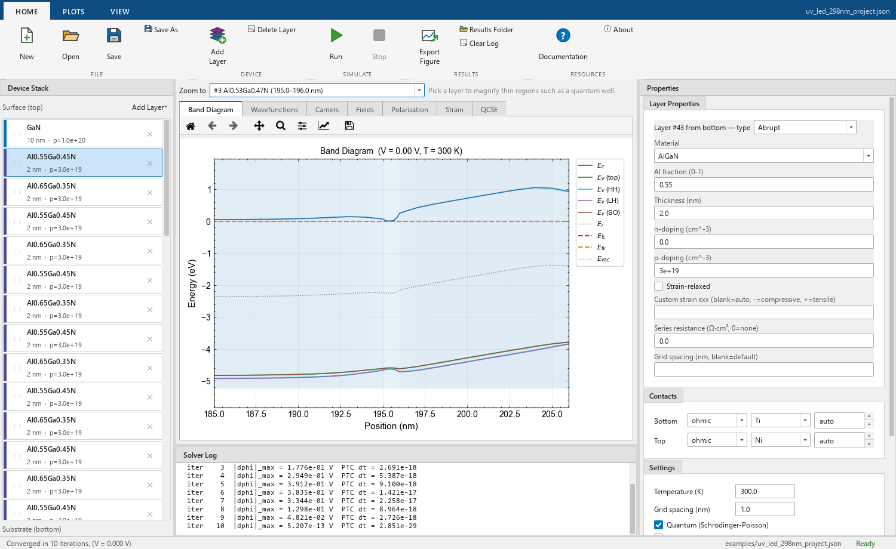

# EpiBand

A one-dimensional Schrödinger–Poisson–current solver for III-V heterostructures, written in
Python, with a desktop GUI. It covers two material families:

- **wurtzite nitrides**: GaN, AlN, InN and their alloys, grown along the c-axis;
- **zincblende arsenides and phosphides**: GaAs, AlAs, InAs, GaP, AlP, InP and their alloys
  (AlGaAs, InGaAs, InAlAs, InGaP, InGaAsP, AlGaInP, ...), grown along [001].

Given a layer stack it computes band edges, electric field, polarization charge, electron and
hole densities, confined states, quantum-well transition energies and, under bias, the
drift-diffusion current with its Shockley-Read-Hall, radiative and Auger recombination. It can
also simulate the X-ray reciprocal space map of the strain profile and the band diagram under
illumination.



*The AlN/GaN/AlN XHEMT of Kim et al. (arXiv:2506.16670), from File ▸ New from Template: the
electron gas at the upper GaN/AlN interface, with the hole gas at the lower one removed by the
Si δ-doping.*

## Download for Windows

**[Download EpiBand-windows.zip](https://github.com/SiddheshUttarwar/BandDiagramTool/releases/latest/download/EpiBand-windows.zip)** (about 97 MB)

No Python and no installation needed:

1. Download the zip and extract it anywhere.
2. Open the `EpiBand` folder and run `EpiBand.exe`. Keep the `_internal` folder
   beside it.
3. Start with **File ▸ New from Template**.

For 64-bit Windows 10 or 11. The program is not code-signed, so Windows may show "Windows
protected your PC" the first time: choose **More info**, then **Run anyway**. Solved results are
written as CSV to a `results` folder beside the `.exe`. Everything under
[Using the GUI](#using-the-gui) applies; the command-line scripts and the Python API need the
source install below.

## Contents

- [Download for Windows](#download-for-windows)
- [The mathematics](#the-mathematics)
- [What it is, and what it is not](#what-it-is-and-what-it-is-not)
- [Install](#install)
- [Using the GUI](#using-the-gui)
- [Using the command line](#using-the-command-line)
- [Using it from Python](#using-it-from-python)
- [Validation](#validation)
- [Tests](#tests)
- [Repository layout](#repository-layout)
- [Sources](#sources)
- [Licence](#licence)

## The mathematics

**Model reference: <https://siddheshuttarwar.github.io/BandDiagramTool/>**

Every equation the solver uses, the parameter tables with their sources, the solution algorithms
and the validation results, one chapter per topic:

| Chapter | Covers |
|---|---|
| [1. Structure and grid](https://siddheshuttarwar.github.io/BandDiagramTool/01_structure_and_grid.html) | layers, contacts, the non-uniform mesh |
| [2. Materials](https://siddheshuttarwar.github.io/BandDiagramTool/02_materials.html) | band gaps and bowing, offsets, masses, dopant levels, temperature dependence |
| [3. Strain](https://siddheshuttarwar.github.io/BandDiagramTool/03_strain.html) | biaxial strain, deformation potentials, valence-band splitting |
| [4. Polarization](https://siddheshuttarwar.github.io/BandDiagramTool/04_polarization.html) | spontaneous and piezoelectric polarization, interface charge, polarity |
| [5. Electrostatics](https://siddheshuttarwar.github.io/BandDiagramTool/05_electrostatics.html) | Poisson's equation, carrier statistics, contacts and surface barriers |
| [6. Quantum mechanics](https://siddheshuttarwar.github.io/BandDiagramTool/06_quantum.html) | the Schrödinger equation and subband densities |
| [7. Currents](https://siddheshuttarwar.github.io/BandDiagramTool/07_currents.html) | drift-diffusion, recombination, current conservation |
| [8. Optics](https://siddheshuttarwar.github.io/BandDiagramTool/08_optics.html) | transition energies, overlap, the Stark effect, gain |
| [9. Solution algorithms](https://siddheshuttarwar.github.io/BandDiagramTool/09_solution_algorithms.html) | how the coupled equations are solved |
| [10. Validation](https://siddheshuttarwar.github.io/BandDiagramTool/10_validation.html) | comparison with nextnano++ and with 102 published experiments |
| [11. Limits](https://siddheshuttarwar.github.io/BandDiagramTool/11_limits_and_comparison.html) | what is left out, and a feature-by-feature comparison with nextnano++ |
| [12. Reciprocal space map](https://siddheshuttarwar.github.io/BandDiagramTool/12_reciprocal_space_map.html) | X-ray map from the strain profile, relaxation, comparison with a measured map |
| [13. Bands under illumination](https://siddheshuttarwar.github.io/BandDiagramTool/13_bands_under_illumination.html) | absorption, generation, the open-circuit solution and photovoltage |
| [14. Defects under illumination](https://siddheshuttarwar.github.io/BandDiagramTool/14_defects_under_illumination.html) | compensating-defect reduction by light during growth, compared with experiment |
| [15. Zincblende arsenides and phosphides](https://siddheshuttarwar.github.io/BandDiagramTool/14a_zincblende_materials.html) | GaAs, InP, GaP, InAs and their alloys: valleys, band alignment, strain |
| [A. Benchmark tables](https://siddheshuttarwar.github.io/BandDiagramTool/15_benchmark_tables.html) | every paper with its measured and computed value |

## What it is, and what it is not

It is a small, readable tool whose physics is documented equation by equation. For the nitrides
its accuracy has been measured against 102 published experiments. The arsenide and phosphide
model uses the standard Vurgaftman parameter set and has been compared with 25 papers on lasers,
LEDs, quantum wells, intersubband detectors, band offsets and bulk alloys (9.0 / 10; see
[chapter 15](https://siddheshuttarwar.github.io/BandDiagramTool/14a_zincblende_materials.html)).
That benchmark is smaller and has almost no transport data.

It is not a replacement for a general device simulator. It is one-dimensional, one growth
orientation per family (c-plane wurtzite, (001) zincblende), single-band (no k·p), and its
transport model is plain drift-diffusion without tunnelling. The
[limits chapter](https://siddheshuttarwar.github.io/BandDiagramTool/11_limits_and_comparison.html)
lists what is left out.

## Install

To run from source (needed for the command line and for Python scripts): Python 3.10 or newer
(developed on 3.11, Windows).

```
git clone https://github.com/SiddheshUttarwar/BandDiagramTool.git
cd BandDiagramTool
pip install -r requirements.txt
```

This installs NumPy, SciPy, Matplotlib, SciencePlots, PyQt6 and pytest. Run every command below
from the `BandDiagramTool` folder.

## Using the GUI

```
python run_gui.py
```

### The window

| Area | What it is for |
|---|---|
| Menu bar | File, Edit, View, Simulation, Help |
| Toolbar | new / open / save, run / stop, then one button per figure, then export and the manual |
| Side panel (left) | three tabs: **Structure**, **Simulation**, **Style** |
| Graphics area | the current figure, with a tool palette on its left (reset view, pan, zoom, export) |
| Text area (bottom) | **Summary** of the solution, and the live **Solver output** |
| Status bar | messages, the cursor position in the figure, and Ready / Solving |

### 1. Get a device

The quickest start is **File ▸ New from Template**, which loads a complete device and solves it:

| Template | What it is |
|---|---|
| AlGaN/GaN HEMT | 25 nm Al₀.₃Ga₀.₇N on GaN; polarization-induced electron gas |
| AlN/GaN/AlN XHEMT | 20 nm strained GaN channel between AlN on an AlN substrate, with Si δ-doping |
| GaN/AlN quantum well | 2.6 nm well; built-in field and Stark shift |
| AlGaN deep-UV LED | multiple quantum wells, blocking layer, p-type superlattice |
| GaN p–n diode | abrupt junction at 2.9 V forward bias |
| AlGaAs/GaAs HEMT | modulation-doped Al₀.₃Ga₀.₇As/GaAs with Si δ-doping; electron gas without polarization |
| InGaAs/InP quantum well | 8 nm In₀.₅₃Ga₀.₄₇As lattice-matched to InP; the 1.55 µm transition |
| AlGaAs/GaAs double heterostructure | GaAs between doped Al₀.₃Ga₀.₇As at 1.3 V; recombination by mechanism |

To build your own, use the **Structure** tab:

1. Press **New** beside the layer table and choose **Layer** (or Graded layer). Each new layer
   goes on top of the stack. The table lists the surface at the top and the substrate at the
   bottom; the `#` column counts from the substrate.
2. Click a row to select it. Its fields appear under **Selected layer**: material, composition,
   thickness, donors and acceptors in cm⁻³. Typed values are applied automatically. The material
   list has the nitrides (AlGaN, InGaN, InAlGaN) above a line and the arsenides and phosphides
   (AlGaAs, InGaAs, AlGaInAs, GaAsP, InGaP, AlGaInP, InGaAsP, AlGaInAsP) below it; only the
   fractions that material uses are shown. GaAs is AlGaAs with Al = 0, InP is InGaP with In = 1,
   InAlAs is AlGaInAs with Al + In = 1. A structure uses one family, not both.
3. **Up** and **Down** move the selected layer; **Delete** removes it.
4. Under **Contacts**, set the top and bottom contact: Ohmic or Schottky, the metal, and for a
   Schottky contact its barrier in eV (`auto` uses the metal work function). A free surface is
   modelled as a Schottky top contact whose barrier is the surface Fermi-level pinning.

The **New** menu also adds three zero-thickness entries:

| Entry | Use |
|---|---|
| Quantum region marker | place one *start* and one *end* to mark where the Schrödinger equation is solved |
| Surface states | donor- or acceptor-like trap levels at an interface, with density and energy |
| Interface dipole | a fixed pair of opposite sheet charges |

Optional fields per layer, under **Strain and mesh**: *Strain-relaxed* (the layer takes its own
lattice constant), *Strain εxx* (set the in-plane strain by hand), *Series resistance*, and
*Grid spacing* for that layer only (use a fine mesh in thin wells).

### 2. Set up the simulation

On the **Simulation** tab:

| Setting | Meaning |
|---|---|
| Temperature | in K; band gaps follow it |
| Grid spacing | default mesh spacing in nm |
| Applied bias | in V, applied to the top contact; 0 solves equilibrium |
| Bias model | how the quasi-Fermi levels are found under bias (see below) |
| Insulator gap | only for the nextnano++ Fermi level; 1 eV is nextnano++'s default |
| Schrödinger–Poisson (quantum) | solve for confined states in the quantum region |
| Spontaneous polarization | include it in addition to the piezoelectric part |
| Flat quasi-Fermi levels | band diagram under bias without solving for current; fast and robust |
| Polarity | metal-polar [0001] or N-polar [000-1] |
| Polarization set | Ambacher 2002 (default) or Dreyer 2016 constants |
| Solver settings | iteration limit, tolerance, damping, number of subbands |

#### Bias models

The bias is applied to the top contact; the bottom contact stays at 0. A positive voltage lowers
the top contact's Fermi level by that many eV.

| Bias model | What it does | Use it for |
|---|---|---|
| Automatic (default) | gate voltage when the top contact is a Schottky contact on an undoped or lightly doped layer of a structure that is not a p–n diode; current otherwise | everything, unless you know you want one of the others |
| Gate voltage | no current. The channel and everything below it keep the source Fermi level (0); across the depleted barrier above the channel the level goes in a straight line to the gate's value | HEMTs and other gated structures |
| Current (drift-diffusion) | solves the current equations between the two contacts; the electron and hole quasi-Fermi levels follow from current continuity | LEDs, lasers, p–n and Schottky diodes |
| nextnano++ Fermi level | one Fermi level interpolated between the two contacts, weighted by exp(E<sub>g</sub> / insulator gap), as nextnano++ draws it when it does not solve the current equation | comparing with a nextnano++ Poisson-only bias sweep |

Why a transistor needs the gate model: in a HEMT the channel is held at the source potential by
its lateral contacts, which a one-dimensional stack does not contain. In an AlN/GaN/AlN structure
the channel has no path to either contact of the stack, and a vertical current solve lets it
drift up to the gate's level, so that it is never depleted. With the gate model a negative gate
voltage depletes the electron gas and pinches it off.

Things the program tells you in the Summary pane rather than hiding:

- **Bias mode**: which of the models was used.
- **Gate turned on**: a gate forward-biased beyond its own barrier height conducts. No
  current-free band diagram exists for the excess voltage, so the structure is shown at the
  turn-on limit and the Summary says at which voltage.
- **Minimum density in the current equation**: in a current solve, a layer cut off from both
  contacts has a quasi-Fermi level that the equations cannot fix. The solver then gives the flux
  a small minimum carrier density, converges, and says so. Bands and densities are reliable; a
  current of that size is the leakage of the minimum density, not a prediction.
- **Current below the numerical resolution**: printed instead of a number when the current is
  too small to be conserved by the arithmetic.

The nextnano++ Fermi level is a drawing rule, not a transport result. With the default 1 eV it
ramps almost linearly across the whole structure, so in a HEMT the channel follows the gate and
the electron gas hardly responds to the gate voltage; 0.05 eV keeps it flat in the narrow-gap
layers and puts the drop in the barrier.

### 3. Run

Press **Run** (the green arrow, **Simulation ▸ Run**, or **F5**). **Esc** stops a running solve.
The Solver output tab shows progress; when it finishes, the Summary tab lists convergence, bias,
electron and hole sheet densities, peak field, transition and subband energies, and interface
polarization charges. Editing the device afterwards does not re-solve; press Run again.

### 4. Read the figures

Switch figures with the toolbar buttons, the **View** menu, or **Ctrl+1** to **Ctrl+9** and **Ctrl+0** for the tenth:

| Figure | Shows |
|---|---|
| Bands | conduction and valence band edges, heavy-hole / light-hole / split-off edges, quasi-Fermi levels. Under bias each quasi-Fermi level is drawn only where its carriers exist |
| Wavefunctions | confined-state probability densities on the band diagram (needs quantum on) |
| Carriers | electron and hole density on a log scale |
| Recombination | Shockley-Read-Hall, radiative and Auger rates on a log scale (dashed where a rate is net generation) |
| Field | electric field F, polarization field −P/ε, and on the right-hand axis the displacement D = εF + P, which is flat wherever there is no free charge; the quasi-electric field of a composition gradient is drawn for reference |
| Polarization | spontaneous, piezoelectric and total polarization |
| Strain | in-plane and out-of-plane strain |
| Stark | transition energy and electron–hole overlap of the quantum well |
| RSM | X-ray reciprocal space map (see below) |
| Illuminated | bands under light (see below) |

In the graphics area, the palette on the left resets the view, pans, zooms to a rectangle and
exports. The status bar shows the cursor position.

After a solve under bias the **Summary** pane lists the three recombination mechanisms integrated
over the device as current densities, their shares, and the radiative efficiency (radiative over
total). The coefficients are those of each material; to set your own SRH lifetimes, radiative
coefficient *B* or Auger coefficient *C* for the whole structure, open **Solver settings** on the
Simulation tab and fill in the fields under *Recombination* (blank means the material value).

The **Style** tab controls what is drawn: **Region shown** zooms every figure to one layer and
its surroundings (useful for a thin well in a thick device), and checkboxes switch individual
band-diagram curves, layer shading, grid lines and the legend. The intrinsic and vacuum levels
are off by default.

### 5. Reciprocal space map

After a run, open the **Strain** figure. A row above it has a **Reflection** selector and
**Calculate reciprocal space map**. The result opens in the **RSM** figure, and the Summary
lists, for each alloy in the stack, Qx and Qz as grown and fully relaxed (in Å⁻¹, and Qz in
reciprocal lattice units for Cu Kα1).

- Asymmetric reflections, e.g. (10-15), give a map over Qx and Qz. The dashed line is the rod of
  the bottom layer; a layer on it is pseudomorphic. Numbered circles mark where each alloy would
  sit if fully relaxed.
- Symmetric reflections, e.g. (0002), give the scan along Qz with thickness fringes and
  superlattice satellites.

The simulation is kinematical: no dynamical diffraction, absorption or mosaic broadening, and
the substrate below the simulated stack is not included.

### 6. Bands under illumination

In the **Illumination** box on the Simulation tab, set the temperature, wavelength, power and
absorption coefficient, and press **Solve bands under light**. It does not need a prior Run. The
**Illuminated** figure compares the dark band diagram (dashed grey) with the illuminated one,
and the carrier densities below it.

Light enters through the top surface and is absorbed only where the photon energy exceeds the
local band gap. No current is drawn: the bias across the structure is adjusted until the total
current is zero, and that bias is reported as the photovoltage. The top contact stands for the
free surface, with both quasi-Fermi levels pinned together there, which underestimates the
carrier density right at the surface.

### 7. Save, open and export

| Action | How |
|---|---|
| Save or open a device | **File ▸ Save** / **Open** (Ctrl+S, Ctrl+O); projects are `.json` files |
| Export the current figure | **File ▸ Export Figure** (Ctrl+E): PNG, PDF or SVG at 300 dpi |
| Get the numbers | every solved result is written as CSV to the `results/` folder; **File ▸ Open Results Folder** opens it |
| Open the model reference | **Help ▸ Manual** (F1) |

## Using the command line

Six runnable scripts are in `examples/`. Each prints its result to the terminal.

```
python examples/01_hemt_2deg.py
python examples/02_quantum_well_stark_effect.py
python examples/03_surface_barrier_from_measurement.py
python examples/04_pn_diode_under_bias.py
python examples/05_reciprocal_space_map.py
python examples/06_defects_under_illumination.py
```

| Script | What it does |
|---|---|
| `01_hemt_2deg.py` | sheet density of an AlGaN/GaN electron gas: classical and quantum, both polarization sets, and N-polar |
| `02_quantum_well_stark_effect.py` | field, transition energy and overlap of GaN/AlN wells of several widths |
| `03_surface_barrier_from_measurement.py` | extracts the surface barrier from published thin-barrier Hall data |
| `04_pn_diode_under_bias.py` | forward current of a GaN p–n diode, with the current-conservation check |
| `05_reciprocal_space_map.py` | reciprocal space map of 1.8 µm Al₀.₆Ga₀.₄N on AlN, coherent against relaxed, compared with Rathkanthiwar et al., *Appl. Phys. Lett.* 120, 202105 (2022); also writes `examples/rsm_algan_on_aln.png` |
| `06_defects_under_illumination.py` | reduction of compensating point defects by light during growth |

### Defects under illumination

This calculation is available only from the command line. For each doped layer, taken as the
free growth surface, it prints the quasi-Fermi level splitting the light produces and the factor
by which the charged state of each compensating defect is reduced.

```
python examples/06_defects_under_illumination.py
python examples/06_defects_under_illumination.py my_device.json --wavelength 365 --power 2
python examples/06_defects_under_illumination.py --help
```

Without a file it runs Mg-doped GaN on Si-doped GaN. With a file it uses the layers of a project
saved from the GUI.

| Option | Default | Meaning |
|---|---|---|
| `--temperature` | 1040 | growth temperature, °C |
| `--wavelength` | 300 | wavelength of the light, nm |
| `--power` | 1 | power density at the wafer, W/cm² |
| `--lifetime` | 0.3 | minority-carrier lifetime, ns |
| `--absorption` | 3e5 | absorption coefficient above the gap, cm⁻¹ |
| `--surface-velocity` | 0 | surface recombination velocity, cm/s |
| `--capture-ratio` | 1 | capture cross-section for the carrier a charged defect attracts, relative to the one it repels |
| `--no-diffusion` | off | keep the carriers where they are generated |

Treat the output as an estimate. It depends strongly on the lifetime and on the capture ratio,
which is not known for these defects, and it agrees with the published measurements only to
within a factor of two to eight. The model, its limits and the comparison are in
[chapter 14](https://siddheshuttarwar.github.io/BandDiagramTool/14_defects_under_illumination.html).

## Using it from Python

### A first calculation

```python
from devices.device import AlGaNDevice
from devices.layer import AbruptLayer, Contact
from devices.analysis import sheet_density

layers = [AbruptLayer(x_Al=0.0, thickness_nm=200, n_doping=1e16),   # GaN buffer
          AbruptLayer(x_Al=0.3, thickness_nm=25)]                   # Al0.3Ga0.7N barrier
contacts = [Contact('bottom', 'ohmic', 'Ti'),
            Contact('top', 'schottky', 'Ni', barrier_eV=1.23)]      # surface pinning

device = AlGaNDevice(layers, contacts, T=300, dx_nm=0.5)
result = device.solve(V_applied=0.0, quantum=False)
print(sheet_density(result, 150, 225))    # electron sheet density between 150 and 225 nm, cm^-2
```

Layers are listed from the substrate up. Save the snippet as a file in the repository folder and
run it with `python my_script.py`.

### Building a structure

| Class | Purpose | Main arguments |
|---|---|---|
| `AbruptLayer` | a uniform layer | `x_Al`, `x_In`, `x_P`, `material`, `thickness_nm`, `n_doping`, `p_doping`, `relaxed`, `dx_nm` |
| `GradedLayer` | composition graded from bottom to top | `x_Al_start`, `x_Al_end` (and `x_In_*`, `x_P_*`), `material`, `thickness_nm`, `profile` (`'linear'`, `'parabolic'`, `'stepped'`) |
| `QuantumRegionMarker` | `'start'` / `'end'` of the Schrödinger region | `boundary` |
| `Contact` | bottom or top contact | `position`, `contact_type` (`'ohmic'` / `'schottky'`), `metal`, `barrier_eV` |

Doping is in cm⁻³, thickness in nm. All are imported from `devices.layer`.

Without `material` a layer is a nitride (`x_Al=0.3` is Al₀.₃Ga₀.₇N). An arsenide or phosphide
layer names its material class; `x_P` is the phosphorus fraction of the group-V atoms:

```python
from devices.layer import AbruptLayer, Contact
from devices.device import Device          # the same class as AlGaNDevice

layers = [
    AbruptLayer(x_Al=0.0, thickness_nm=100, material='InGaP', x_In=1.0),      # InP
    AbruptLayer(x_Al=0.0, thickness_nm=8, material='InGaAs', x_In=0.53),      # In0.53Ga0.47As
    AbruptLayer(x_Al=0.0, thickness_nm=100, material='InGaP', x_In=1.0),
]
device = Device(layers, [Contact('bottom', 'ohmic', 'Ti'), Contact('top', 'ohmic', 'Au')], dx_nm=0.25)
result = device.solve(quantum=True)
print(result.qcse_transition_eV)           # 0.80 eV, 1.55 µm
```

| `material` | Fractions you set | Notes |
|---|---|---|
| `'AlGaN'`, `'InGaN'`, `'InAlGaN'` | `x_Al` / `x_In` / both | wurtzite |
| `'AlGaAs'` | `x_Al` | `x_Al=0` is GaAs |
| `'InGaAs'` | `x_In` | `x_In=1` is InAs |
| `'AlGaInAs'` | `x_Al`, `x_In` | `x_Al + x_In = 1` is InAlAs |
| `'GaAsP'` | `x_P` | `x_P=1` is GaP |
| `'InGaP'` | `x_In` | all phosphorus; `x_In=1` is InP |
| `'AlGaInP'` | `x_Al`, `x_In` | all phosphorus |
| `'InGaAsP'` | `x_In`, `x_P` | |
| `'AlGaInAsP'` | `x_Al`, `x_In`, `x_P` | any composition |

### Device and solve options

| Option | Meaning |
|---|---|
| `AlGaNDevice(..., T=...)` | temperature in K |
| `AlGaNDevice(..., dx_nm=...)` | default mesh spacing in nm |
| `AlGaNDevice(..., polarity='N')` | N-polar growth; default is metal-polar |
| `AlGaNDevice(..., polarization_model='dreyer2016')` | Dreyer 2016 constants; default is Ambacher 2002 |
| `AlGaNDevice(..., recombination={'tau_n': 5e-9, 'B_rad': 2e-10})` | replace recombination coefficients in every layer: `tau_n`, `tau_p` in s, `B_rad` in cm³/s, `C_n`, `C_p` in cm⁶/s |
| `solve(quantum=True)` | include the Schrödinger equation |
| `solve(V_applied=V)` | solve under bias with the automatic bias model: gate voltage for a Schottky top contact on an undoped layer, drift-diffusion current otherwise |
| `solve(V_applied=V, gate_bias=True)` | gate voltage: no current, channel at the source Fermi level; `gate_bias=False` forces the drift-diffusion current |
| `solve(V_applied=V, interpolated_qfl=1.0)` | nextnano++-style interpolated Fermi level; the number is the insulator gap in eV |
| `solve(V_applied=V, flat_qfl=True)` | band diagram under bias without solving for current |
| `solve(verbose=True)` | print the iteration log |

### What a result holds

`solve` returns a `SolverResult`. Profiles are NumPy arrays on the grid `result.x_nm`.

| Field | Content |
|---|---|
| `x_nm` | position, nm, from the substrate |
| `Ec`, `Ev`, `Efn`, `Efp` | band edges and quasi-Fermi levels, eV |
| `phi`, `E_field` | potential in V, field in V/m |
| `n`, `p` | electron and hole density, cm⁻³ |
| `Psp`, `Ppz`, `P_total` | polarization, C/m² |
| `eps_xx`, `eps_zz` | strain |
| `E_e`, `psi_e`, `E_h`, `psi_h` | subband energies and wavefunctions (quantum solves) |
| `qcse_transition_eV`, `qcse_overlap` | quantum-well transition energy and overlap |
| `J_total`, `current_conservation_error` | current density in A/cm² and its conservation check (current solves; not a number in the gate and interpolated modes) |
| `bias_mode`, `bias_note`, `V_internal` | `'equilibrium'`, `'current'`, `'gate'`, `'interpolated'` or `'flat'`; a note when the gate has turned on; the bias the solution actually corresponds to |
| `transport_floor_cm3` | minimum density the current equation needed, cm⁻³; 0 when it needed none |
| `eps_r`, `E_polarization`, `D_field` | relative permittivity, polarization field −P/ε in V/m, displacement D = εF + P in C/m² |
| `R_srh`, `R_rad`, `R_aug` | Shockley-Read-Hall, radiative and Auger recombination rates, cm⁻³ s⁻¹ |
| `crystal`, `x_Al`, `x_In`, `x_P` | `'wurtzite'` or `'zincblende'`, and the composition profile |
| `converged`, `n_iterations` | solver status |

### Plots and CSV

```python
from visualization.plotter import plot_band_diagram, plot_all
from visualization.csv_export import save_result_csv

ax = plot_band_diagram(result)
ax.get_figure().savefig('bands.png', dpi=200)

plot_all(result, save_path='overview.png')      # six panels in one figure
save_result_csv(result, 'result.csv')           # every profile, one column each
```

Other panels: `plot_wavefunctions`, `plot_carriers`, `plot_fields`, `plot_polarization`,
`plot_strain`, `plot_qcse`.

### Reciprocal space map

```python
from physics.rsm import simulate_rsm
from visualization.plotter import plot_rsm

rsm = simulate_rsm(result, hkl=(1, 0, 5))       # (h, k, l); i = -(h + k) is implied
for name, qx, qz in rsm.strained_points:
    print(name, qx, qz)                          # 1/Angstrom, Q = 2 pi / d
plot_rsm(rsm).get_figure().savefig('rsm.png', dpi=200)
```

Only the strain profile is needed, so `simulate_rsm(device.build_grid(), ...)` works without a
solve.

### Bands under illumination

```python
from physics.illumination import solve_illuminated

r = solve_illuminated(device, wavelength_nm=300, power_W_cm2=1.0)
print(r.photovoltage_V, r.absorbed_fraction)
dark, light = r.dark, r.light                    # two SolverResults to compare
```

### Defects under illumination

```python
from physics.dqfl import simulate_illumination

out = simulate_illumination(layers, T_growth_C=1040, wavelength_nm=300, power_W_cm2=1.0)
for layer in out.layers:
    for d in layer.defects:
        print(layer.name, d.compensator.name, d.factor)
```

## Validation

| Check | Result |
|---|---|
| Numerics against nextnano++ (12 structures, same parameters) | sheet densities within 3%; band edges within about 10 meV where the comparison grid resolves the structure |
| 102 published experiments, 153 measured values, default settings, nothing tuned per paper | 7.2 / 10 overall |
| Electron-gas sheet density (56 values) | median 20% above measurement; 57% within 30%, 86% within a factor of two |
| Dopant levels, polarization charge, hole gases | within 20% or 50 meV |
| Arsenides and phosphides: 25 published experiments, 38 measured values (lasers, LEDs, quantum wells, intersubband detectors, offsets, bulk alloys) | 9.0 / 10; median energy error 20 meV; one electron-gas value, no bias data |
| Weakest areas | band offsets involving InN; emission energy of monolayer wells and of LEDs under injection; forward prediction for barriers thinner than about 4 nm |

The [validation chapter](https://siddheshuttarwar.github.io/BandDiagramTool/10_validation.html)
gives the method, the failures and their causes, and the
[appendix](https://siddheshuttarwar.github.io/BandDiagramTool/15_benchmark_tables.html) lists every
paper. The benchmark was assembled with machine assistance and has not been reviewed by an
independent expert; corrections are welcome.

The newer modules have been checked less:

| Module | Status |
|---|---|
| Reciprocal space map | peak positions reproduce the coherent Al₀.₆Ga₀.₄N-on-AlN maps of Rathkanthiwar et al. (2022) to within the reading error of their figure; intensities and line shapes are not validated |
| Bands under illumination | internally consistent (zero current, correct limits); not compared with a measurement |
| Defects under illumination | within a factor of two to eight of three published data sets; not a validated predictor |
| Anything under bias | not validated against experiment. The gate model reproduces the pinch-off voltage expected from the sheet density and barrier thickness of an AlN/GaN/AlN HEMT, and its response to gate voltage agrees with BandEng on an AlGaN/GaN HEMT (1.9 against 2.1×10¹² cm⁻² per volt). The drift-diffusion current could not be compared with nextnano++: its free edition does not solve the current equation |

## Tests

```
python -m pytest                  # all 101 tests, about one minute
python -m pytest -m "not slow"    # the quick subset
```

## Repository layout

| Path | Contents |
|---|---|
| `devices/` | layers, contacts, grid construction, analysis helpers |
| `physics/` | materials, strain and polarization, Poisson, Schrödinger, drift-diffusion, optics, reciprocal space map, illumination |
| `gui/` | the PyQt6 interface |
| `visualization/` | plot functions and CSV export |
| `examples/` | the runnable scripts above |
| `tests/` | the test suite |
| `docs/` | the published model reference (`docs/build/` regenerates it) |
| `run_gui.py` | starts the GUI |
| `EpiBand.spec` | PyInstaller recipe for the Windows program: `pip install pyinstaller`, then `pyinstaller --noconfirm EpiBand.spec` |

## Sources

Material parameters and models are taken from the literature; each chapter of the model
reference names its sources. The main ones:

- Vurgaftman and Meyer (2003): band parameters and deformation potentials of the nitrides
- Vurgaftman, Meyer and Ram-Mohan (2001): band parameters of the arsenides and phosphides
- Ambacher et al. (2002) and Bernardini et al. (1997): polarization
- Dreyer et al. (2016): the alternative polarization set
- Alberi and Scarpulla (2018) and the North Carolina State University papers of Bryan, Reddy,
  Klump and co-workers (2014–2020): defect formation under illumination

## Licence

No licence has been chosen yet. Until one is added, the code is published for reading and
evaluation only.
